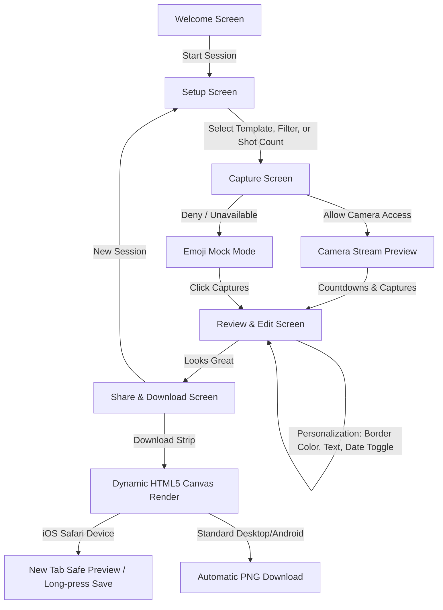

# 📷 Simply Snap — Classic Web Photo Booth

[](https://opensource.org/licenses/MIT)
[](index.html)
[](#privacy--security)

**Simply Snap** is a premium, client-side web application that emulates a classic physical photo booth. Designed with a sleek, dark retro aesthetic, it features real-time color filters, precision image adjustments, multiple strip templates, custom event branding, and a specialized iOS/Safari-compatible image-rendering engine. 

With zero server-side dependencies, all image processing, filtering, and assembly happen directly inside your web browser. 

---

## 🗺️ Application Workflow



---

## ✨ Key Features

### 🖥️ Interactive Multi-Step Journey
*   **Welcome Screen:** Elegant landing screen featuring a dynamic background film-drift animation, ambient overlays, and glassmorphic button states.
*   **Setup Panel:** Configure layouts, default shots, and pre-capture filters.
*   **Viewfinder & Capture Zone:** 3-second visual countdown with camera grid lines, a simulated camera flash effect, and live filter toggles.
*   **Review & Edit Studio:** Live, responsive interactive mockup of your final photo strip. Edit adjustments on the fly with immediate visual feedback.
*   **Export Center:** Renders and downloads high-definition composite images, optimized for standard sharing.

### 🖼️ Layout Templates
Simply Snap offers six distinct, historically inspired strip layouts. Selecting a template automatically configures the recommended shot count, which can be manually overridden:

| Template | Layout ID | Default Shots | Description | Visual Layout |
| :--- | :--- | :---: | :--- | :--- |
| **Classic** | `classic` | 3 | Vertical stack of 3 images | 1 column x 3 rows |
| **Duo** | `duo` | 2 | Side-by-side landscape comparison | 2 columns x 1 row |
| **Grid 2×2** | `grid` | 4 | Multi-person grid setup | 2 columns x 2 rows |
| **Widestrip** | `widestrip` | 4 | Cinematic film strip aspect ratio | 1 column x 4 rows (16:9) |
| **Magazine** | `magazine` | 3 | Borderless, full-bleed vertical layout | 1 column x 3 rows (No borders) |
| **Polaroid** | `polaroid` | 1 | Standard instant film layout | 1 image with thick bottom margin |

### 🎞️ Mood Filters
Apply instant color-grading presets to your shots. Powered by inline browser CSS filters and matching custom canvas matrices for export:

*   **Original (`none`):** Unprocessed, raw camera sensor coloring.
*   **Vivid (`vivid`):** Saturated colors and bumped contrast for active party settings.
*   **B & W (`bw`):** Classic high-contrast monochrome silver-halide simulation.
*   **Sepia (`sepia`):** Retro, warm, aged-photograph coloration.
*   **Cool (`cool`):** Ice-cold color temperature shift with bumped saturation.
*   **Warm (`warm`):** Soft, sunset-inspired golden glow filter.
*   **Fade (`fade`):** Lowered contrast and saturation for a matte, cinematic feel.
*   **Drama (`dramatic`):** Deep shadows, high contrast, and slightly dimmed exposures.
*   **Soft (`soft`):** Warm, low-contrast pastel grading with a minor focal softening.

### 🎛️ Live Adjustment Controls
Fine-tune image outputs inside the edit panel:
*   **Brightness:** Adjust from `-100%` to `+100%`.
*   **Contrast:** Enhance details or flatten tones (`-100%` to `+100%`).
*   **Saturation:** Shift between deep color values and grayscale elements (`-100%` to `+100%`).
*   **Vignette:** Applies a dark, radial shadow overlay mimicking vintage camera lenses (`0` to `100%`).

### ✍️ Custom Event Branding
*   **Custom Labels:** Customize the text displayed at the bottom of the strip (e.g. `"WEDDING DAY 2026"`, `"SIMPLY SNAP"`).
*   **Date Toggle:** Optionally print the current date (formatted as *Month Day, Year*) using clean monospace typography directly beneath the branding text.
*   **Dynamic Borders:** Choose from 8 aesthetic backing borders: Off-White, Clean White, Jet Black, Vintage Gold, Ocean Teal, Coral Red, Pastel Purple, and Neon Pink. The text color automatically shifts between light and dark depending on border contrast.

---

## ⚙️ Advanced Browser Implementation

### 📱 iOS / Safari Filter Bypass
Under standard iOS WebKit rules, Applying standard CSS filters (e.g., `video.style.filter = 'grayscale(1)'`) on live camera elements is often ignored, and drawing filtered videos directly onto canvas buffers results in unfiltered exports. 
Simply Snap solves this by implementing a **real-time offscreen canvas buffer renderer**:
1. When a camera stream is established, a secondary `<canvas id="cam-filter-overlay">` is positioned directly over the hidden video.
2. A `requestAnimationFrame` render loop grabs the raw frames from the video element and writes them onto this canvas.
3. The app's CSS filters are applied directly to the canvas container, bypassing mobile WebKit `<video>` hardware-acceleration limitations.
4. During download generation, the canvas compositor reads raw image inputs and runs mathematical string replacements on the filter inputs (e.g., stripping out blur filters to avoid low-resolution text exports) before applying them programmatically onto the final high-definition Canvas export.

### 🔄 Intelligent Camera Mirroring & Switching
*   **Front Camera:** Automatically mirrors user video stream horizontally (`scaleX(-1)`) to feel natural during capture.
*   **Rear Camera:** Skips mirroring (`scaleX(1)`) so text or background elements in rear-camera mode remain readable.
*   **Flip Camera:** Dynamically searches device hardware inputs to cycle between front (`user`) and rear (`environment`) media sources.

### 🎮 Keyboard Shortcuts
*   Press **[Spacebar]** in the capture viewport to instantly trigger the 3-second capture sequence.

### 🛠️ Mock Mode Fallback
If the user denies camera access, or if the device lacks an active capture sensor, Simply Snap switches to **Mock Mode**. Viewfinders display placeholder messages, and captures render randomized emojis on premium, color-blocked retro backgrounds. This allows developers and users to experience the full customization, layouts, sliders, and high-res export system without needing a camera.

---

## 📁 File Structure

```bash
PhotoBooth Project 2/
├── index.html         # Application markup and screen structures
├── style.css          # Design tokens, CSS variables, screen layout, and glassmorphism styling
├── script.js          # Camera logic, state machine, adjustments, and canvas export engine
├── README.md          # Project documentation (this file)
└── logo/
    └── simply-snap-logo.svg  # SVG Vector logo asset
```

---

## 🚀 Running & Hosting

### Run Locally
Simply Snap is a static client-side web application. It requires no compilers, no node module installations, and no builders.

1.  **Option A (Direct File):** Simply double-click `index.html` to open it in your web browser. *(Note: Camera streams require secure origins; some browsers require localhost or HTTPS to grant webcam access).*
2.  **Option B (Local Web Server):** For best camera permission results, serve it via a local web server:
    *   Using Python:
        ```bash
        python -m http.server 8000
        ```
    *   Using Node (`serve`):
        ```bash
        npx serve .
        ```
    *   Using VS Code: Install the **Live Server** extension and click **Go Live**.
---

## 🔒 Privacy & Security

Simply Snap prioritizes user privacy:
*   All image processing, filtering, cropping, and PNG compiling are executed **locally inside your browser thread**.
*   No photos, audio, metadata, or camera feeds are ever uploaded to a server.
*   The application works entirely offline once loaded.

---

## 📄 License

This project is licensed under the MIT License. Feel free to customize and deploy your own instances!

*Created with ❤️ by [mko-kjl](https://github.com/Mkoo-kjl).*
